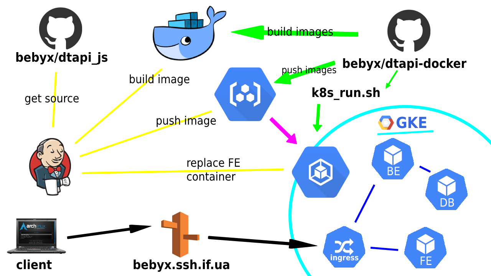

# Kubernetes Deployment Project for D-tester

**D-tester** is a data management application intended to keep track of students exams.

Backend is developed with Ko7, PHP framework, by [Yuriy Bezgachnyuk](https://github.com/yurkovskiy), SoftServe IT Academy mentor. Frontend is developed with Angular by students of SoftServe IT Academy.

The task was to deploy the app as microservices in a k8s cluster, with a container for each D-tester component (database, backend API, frontend, proxy to bind backend and frontend).

My tools of choice and destiny were Docker, Minikube (k8s testing), Google Kubernetes Engine (k8s production), Jenkins (CI/CD), Google Container Registry, AWS Route 53 (domain and DNS, thanks to expert Serhii Shuliar for access).

Other technologies used are Apache2 web-server (both frontend and backend), MariaDB.

# Run the Deployment

To deploy the cluster to GKE you will need to accomplish several pre-configuration and then just run `k8_run.sh`.

1. Install Docker, k8s (`kubectl`) and gcloud.
2. Connect to Google Cloud Platform with [Docker](https://cloud.google.com/container-registry/docs/pushing-and-pulling) and [Kubernetes](https://rancher.com/blog/2020/google-cloud-kubernetes-deploy-on-gke/).
3. Reserve a global external IP address on GCP and remember to put its name
    into `ingress.yaml` instead of `dtapi-k8s`.
4. Check lines 11, 12 in frontend Dockerfile and put your domain name or external IP.
5. Build backend and frontend Docker images and push them to GCR.
6. Change image value in `be-deployment.yaml` and `fe-deployment.yaml`.
7. Run `k8s_run.sh`.
8. Import database dumps from `./database` to database pod, if needed.

# CI/CD

On your Jenkins server, you will need just to create a SCM Pipeline for frontend CI and enable `jenkins` user for GCP and GCR.

You can use this command to switch user: `sudo su -s /bin/bash jenkins`.

All needed files to run the pipeline are already in the repository [bebyx/dtapi_js](https://github.com/bebyx/dtapi_js). Feel free to fork it and change the `Jenkinsfile` and other related files for your convenience.
